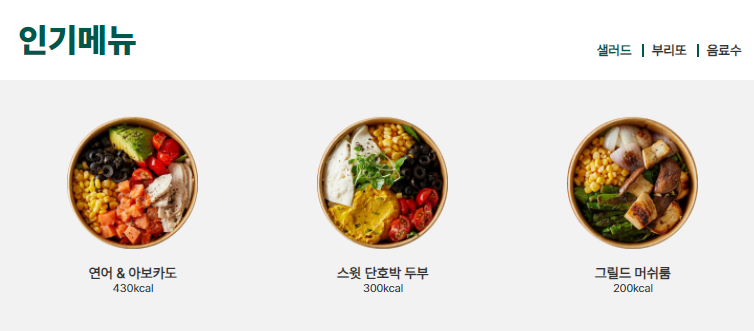

<<<<<<< HEAD
# Greener
<그리너> 홈페이지 제작

## 프로젝트 목표

JavaScript와 SCSS를 이용해 샐러드 브랜드 <그리너>를 소개하는 홈페이지를 제작

## 프로젝트에서 사용한 기술
### JavaScript ES6

jQuery 등의 라이브러리를 사용하지 않고 JavaScript 프로그램 작성

### SCSS 

7-1 패턴을 참고해 컴포넌트별로 나눠 작성했으며, main.scss에 임포트한 후 CSS로 컴파일

## 프로젝트의 기능 설명
### 이미지 슬라이드

* 3초마다 자동으로 이미지가 넘어가는 이미지 슬라이드 기능
* 이미지 하단의 블릿 버튼을 누르면 해당 번호의 이미지로 이동
* 블릿 버튼들은 JavaScript 프로그램에서 슬라이드 이미지의 개수에 따라 생성
* CSS의 background-image 속성을 이용하여 모바일 기기의 해상도에서는 자동으로 모바일용 슬라이드 이미지가 뜨도록 작성

### 스와이프 (모바일 기기 한정)

* 이미지 슬라이드 기능에 스와이프 기능 추가
* 스와이프 방향에 따라 슬라이드가 이동
* 슬라이드의 시작과 끝에서 일정 이상 이동하면, 슬라이드가 컨테이너 영역을 벗어나는 것을 방지하기 위해 제자리를 찾아가도록 작성

### 버튼이 있는 이미지 슬라이드

* 화살표 버튼을 누를 때마다 한 칸씩 이동

### 모바일 대응 반응형 웹페이지

* PC(1024px), 타블렛(768px), 대형 모바일(480px), 소형 모바일 등, 모두 4가지 가로 해상도에 따라 보이도록 미디어 쿼리 작성

> 이 프로젝트에서 쓰인 이미지의 저작권은 (주)그리너에프엔비에 있습니다.

=======
# greener
 그리너 홈페이지 제작

## 프로젝트의 구성 안내

### 목표

샐러드 브랜드 <그리너>를 소개하는 홈페이지를 제작했습니다.

## 기술

#### JavaScript ES6

라이브러리가 없는 순수 자바스크립트로 구성되어있습니다.

#### SCSS 

7-1 패턴을 참고하여 컴포넌트별로 파일을 분류하여 main.scss에 import한 후 CSS로 컴파일 했습니다.

## 기능 설명

#### 1. 자동 슬라이드

3초마다 자동으로 이미지가 넘어가는 자동 슬라이드입니다. 

이미지 하단의 bullet 버튼을 누르면 해당 번호의 이미지로 슬라이딩 됩니다. 

bullet 버튼들은 슬라이드 이미지의 수에 따라 만들어지도록 코드를 짰음

CSS의 background-image 속성을 이용하여 모바일 해상도에서는 자동으로 모바일 전용 슬라이드 이미지가 뜨도록 제작했습니다.

#### 2. 스와이프 (모바일 한정)

슬라이드에 스와이프 기능을 넣었습니다.

터치 방향에 따라 슬라이드가 움직입니다.

슬라이드의 시작과 끝에서 일정 이상 이동할 경우 슬라이드가 제자리를 찾아가는 코드를 작성했습니다. (슬라이드가 컨테이너에서 벗어나는 것을 방지)

#### 3. 버튼이 있는 슬라이드

화살표가 그려진 버튼을 누를 때마다 한 칸씩 이동합니다.

#### 4. 모바일 대응 반응형 홈페이지

랩탑(1024px) 타블렛(768px) 대형 모바일(480px) 소형 모바일 총 4가지 해상도에 따른 미디어쿼리를 작성했습니다.

#### 해당 프로젝트에서 쓰인 가이미지의 저작권은 (주)그리너에프엔비에 있습니다.
>>>>>>> 542188f263a3a96dffdfe4f25590d60d4b8e7214
